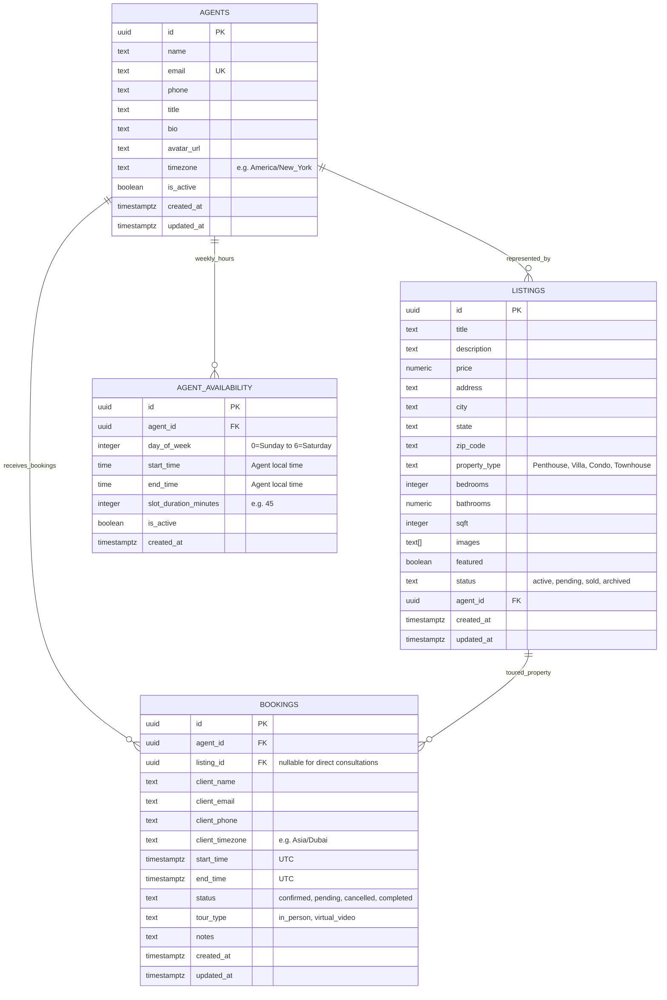

# Cognivelle Realtors — Multi-Agent, Multi-Timezone Real Estate & Booking Platform

A high-performance real estate application built with **Next.js 14 (App Router)** and coupled with **Supabase (PostgreSQL)**. Features an **atomic slot conflict prevention engine** and **multi-timezone showing synchronization** that seamlessly bridges global clients and listing agents across the world.

---

## Architecture & System Overview



---

## 1. Database Schema Specification

The full database schema is located at [`supabase/schema.sql`](supabase/schema.sql) and [`supabase/seed.sql`](supabase/seed.sql).

### Table: `agents`
Represents licensed real estate specialists. Each agent has an operational timezone that determines their working hours.

| Column | Type | Constraints | Description |
|---|---|---|---|
| `id` | `UUID` | `PRIMARY KEY DEFAULT gen_random_uuid()` | Unique agent identifier |
| `name` | `TEXT` | `NOT NULL` | Agent full name |
| `email` | `TEXT` | `UNIQUE NOT NULL` | Business email |
| `phone` | `TEXT` | `NULL` | Business phone number |
| `title` | `TEXT` | `DEFAULT 'Licensed Specialist'` | Position / market focus |
| `bio` | `TEXT` | `NULL` | Professional background summary |
| `avatar_url` | `TEXT` | `NULL` | Photo URL |
| `timezone` | `TEXT` | `NOT NULL DEFAULT 'America/New_York'` | IANA timezone (e.g., `America/Los_Angeles`, `Europe/London`, `Asia/Tokyo`) |
| `is_active` | `BOOLEAN` | `NOT NULL DEFAULT true` | Active operational status |
| `created_at` | `TIMESTAMPTZ` | `NOT NULL DEFAULT now()` | Record creation timestamp |
| `updated_at` | `TIMESTAMPTZ` | `NOT NULL DEFAULT now()` | Automatic trigger update timestamp |

---

### Table: `listings`
Properties aligned to specific agents.

| Column | Type | Constraints | Description |
|---|---|---|---|
| `id` | `UUID` | `PRIMARY KEY DEFAULT gen_random_uuid()` | Unique property ID |
| `title` | `TEXT` | `NOT NULL` | Listing headline |
| `description` | `TEXT` | `NULL` | Detailed property description |
| `price` | `NUMERIC(14, 2)` | `NOT NULL` | Price in USD |
| `address` | `TEXT` | `NOT NULL` | Street address |
| `city` | `TEXT` | `NOT NULL` | City location |
| `state` | `TEXT` | `NOT NULL` | State or region |
| `zip_code` | `TEXT` | `NULL` | Postal code |
| `property_type` | `TEXT` | `NOT NULL DEFAULT 'Single Family'` | `Single Family`, `Condo`, `Townhouse`, `Penthouse`, `Villa` |
| `bedrooms` | `INTEGER` | `NOT NULL DEFAULT 1` | Bedroom count |
| `bathrooms` | `NUMERIC(3, 1)` | `NOT NULL DEFAULT 1.0` | Bathroom count |
| `sqft` | `INTEGER` | `NOT NULL DEFAULT 1000` | Square footage |
| `images` | `TEXT[]` | `NOT NULL DEFAULT '{}'` | Array of image URLs |
| `featured` | `BOOLEAN` | `NOT NULL DEFAULT false` | Featured flag for homepage showcase |
| `status` | `TEXT` | `CHECK (status IN ('active', 'pending', 'sold', 'archived'))` | Listing status |
| `agent_id` | `UUID` | `NOT NULL REFERENCES agents(id) ON DELETE CASCADE` | Aligned listing agent |
| `created_at` | `TIMESTAMPTZ` | `NOT NULL DEFAULT now()` | Creation timestamp |
| `updated_at` | `TIMESTAMPTZ` | `NOT NULL DEFAULT now()` | Automatic trigger update timestamp |

---

### Table: `agent_availability`
Defines agent weekly working windows in their operational timezone.

| Column | Type | Constraints | Description |
|---|---|---|---|
| `id` | `UUID` | `PRIMARY KEY DEFAULT gen_random_uuid()` | Schedule window ID |
| `agent_id` | `UUID` | `NOT NULL REFERENCES agents(id) ON DELETE CASCADE` | Assigned agent |
| `day_of_week` | `INTEGER` | `CHECK (day_of_week BETWEEN 0 AND 6)` | 0 = Sunday, 1 = Monday ... 6 = Saturday |
| `start_time` | `TIME` | `NOT NULL DEFAULT '09:00:00'` | Daily start in agent's timezone |
| `end_time` | `TIME` | `NOT NULL DEFAULT '17:00:00'` | Daily end in agent's timezone |
| `slot_duration_minutes`| `INTEGER`| `NOT NULL DEFAULT 45 CHECK (slot_duration_minutes > 0)` | Showing slot duration (e.g. 45 min) |
| `is_active` | `BOOLEAN` | `NOT NULL DEFAULT true` | Availability toggle for that day |
| `created_at` | `TIMESTAMPTZ` | `NOT NULL DEFAULT now()` | Creation timestamp |

---

### Table: `bookings` (With Atomic Concurrency Exclusion Constraint)
Stores showings and consultations in UTC timestamps.

| Column | Type | Constraints | Description |
|---|---|---|---|
| `id` | `UUID` | `PRIMARY KEY DEFAULT gen_random_uuid()` | Booking ID |
| `agent_id` | `UUID` | `NOT NULL REFERENCES agents(id) ON DELETE CASCADE` | Assigned agent |
| `listing_id` | `UUID` | `REFERENCES listings(id) ON DELETE SET NULL` | Property to tour (optional) |
| `client_name` | `TEXT` | `NOT NULL` | Client's full name |
| `client_email` | `TEXT` | `NOT NULL` | Client email |
| `client_phone` | `TEXT` | `NOT NULL` | Client phone number |
| `client_timezone` | `TEXT` | `NOT NULL DEFAULT 'UTC'` | Client's booking timezone |
| `start_time` | `TIMESTAMPTZ` | `NOT NULL` | Standardized UTC start time |
| `end_time` | `TIMESTAMPTZ` | `NOT NULL` | Standardized UTC end time |
| `status` | `TEXT` | `CHECK (status IN ('pending', 'confirmed', 'cancelled', 'completed'))` | Booking status |
| `tour_type` | `TEXT` | `CHECK (tour_type IN ('in_person', 'virtual_video'))` | In-Person vs Video Tour |
| `notes` | `TEXT` | `NULL` | Inquiries or special requests |
| `created_at` | `TIMESTAMPTZ` | `NOT NULL DEFAULT now()` | Booking creation timestamp |
| `updated_at` | `TIMESTAMPTZ` | `NOT NULL DEFAULT now()` | Trigger update timestamp |

---

## 2. Slot Conflict & Double-Booking Prevention

### The Problem
In real estate scheduling, concurrent requests can create race conditions where two clients in different timezones attempt to book the exact same slot for an agent simultaneously.

### The Solution: 2-Layer Protection

#### Layer 1: PostgreSQL GiST Exclusion Constraint (Database Kernel)
The database enforces slot isolation via `btree_gist`:

```sql
CREATE EXTENSION IF NOT EXISTS "btree_gist";

ALTER TABLE bookings
ADD CONSTRAINT no_overlapping_agent_bookings
EXCLUDE USING gist (
    agent_id WITH =,
    tstzrange(start_time, end_time) WITH &&
) WHERE (status != 'cancelled');
```
- **How it works:** Whenever any transaction attempts to insert or update a non-cancelled booking where `tstzrange(start_time, end_time)` overlaps (`&&`) with an existing booking for the same `agent_id`, PostgreSQL atomically rolls back the transaction with an exclusion violation error.
- Cancelled bookings (`status = 'cancelled'`) are excluded from the constraint, instantly freeing the slot.

#### Layer 2: API & UI Guard (HTTP 409 Conflict)
1. Before attempting insertion, `/api/bookings` checks:
   $$\text{overlap} = (\text{reqStart} < \text{existingEnd}) \land (\text{reqEnd} > \text{existingStart})$$
2. If an overlap is detected, the API returns `HTTP 409 Conflict` with a human-readable explanation.
3. The UI highlights the conflict in real time and automatically refreshes the slot grid.

---

## 3. Multi-Timezone Synchronization Engine

### The Problem
- An agent is based in New York (`America/New_York`, UTC-4).
- A luxury buyer is browsing from Dubai (`Asia/Dubai`, UTC+4) or London (`Europe/London`, UTC+1).
- Scheduling must respect the agent's actual working hours (09:00 - 17:00 local) while allowing the client to view and select slots in their own local time without mental conversion errors.

### The Mathematics & Flow:
1. **Agent Working Window in Agent Timezone:**
   - E.g., `date = '2026-09-22'`, agent working hours `09:00` to `17:00` in `America/New_York`.
2. **Convert to Canonical UTC:**
   - Using `fromZonedTime('2026-09-22 10:00:00', 'America/New_York')` $\rightarrow$ `2026-09-22T14:00:00.000Z`.
3. **Filter Active Bookings:**
   - Active bookings for that agent are checked for overlap in UTC space.
4. **Localize for Client Timezone:**
   - Using `formatInTimeZone(utcDate, 'Asia/Dubai', 'h:mm a')` $\rightarrow$ `6:00 PM (GST)`.
5. **Interactive Display:**
   - The user sees: **`6:00 PM (Your Time: Dubai)`** accompanied by **`Agent Local: 10:00 AM (New York)`**.

---

## 4. Admin Portal Features (`/admin`)

- **Overview Dashboard (`/admin`):**
  - Live KPI metrics (Total Agents, Total Listings, Total Bookings, Confirmed Bookings, Conflicts Prevented Counter).
  - Supabase connectivity status and recent bookings table.
- **Agent Directory Management (`/admin/agents`):**
  - Add multiple agents with unique operational timezones (`America/New_York`, `America/Los_Angeles`, `Europe/London`, `Asia/Tokyo`, `Asia/Dubai`, etc.).
  - Toggle agent active status.
- **Listings Aligned with Agents (`/admin/listings`):**
  - Create property listings and align them directly with a listing agent.
  - Set pricing, specs, images, property type, and listing status.
- **Bookings & Slot Conflict Monitor (`/admin/bookings`):**
  - Master booking viewer across all agents.
  - **Admin Timezone Switcher:** Switch between Admin Local Time, UTC, or Agent Time on the fly.
  - **Interactive Slot Conflict Simulator:** Test overlapping slot collisions directly to observe HTTP 409 and GiST prevention in action.
- **Working Schedules (`/admin/availability`):**
  - Configure weekly working days and hours (Monday through Sunday) per agent.
  - Set custom showing slot duration (30 min, 45 min, 60 min).

---

## 5. Getting Started & Setup

### Prerequisites
- Node.js 18+ (tested on Node 22)
- Supabase project (free tier works) or run in instant local demo mode

### Installation
```bash
npm install
```

### Configure Supabase Credentials
Copy `.env.example` to `.env.local`:
```bash
cp .env.example .env.local
```
Fill in your Supabase credentials from your **Supabase Dashboard > Project Settings > API**:
```env
NEXT_PUBLIC_SUPABASE_URL=https://your-project.supabase.co
NEXT_PUBLIC_SUPABASE_ANON_KEY=your-anon-key
```

*(Note: If you run the app without setting `.env.local`, the application seamlessly falls back to the in-memory repository with realistic mock data, so you can test all features immediately!)*

### Run Database Migrations in Supabase
1. Open the **SQL Editor** in your Supabase Dashboard.
2. Paste the contents of [`supabase/schema.sql`](supabase/schema.sql) and execute.
3. Paste the contents of [`supabase/seed.sql`](supabase/seed.sql) to populate initial global agents and listings.

### Launch Development Server
```bash
npm run dev
```
Open [http://localhost:3000](http://localhost:3000) to view the public site, or [http://localhost:3000/admin](http://localhost:3000/admin) to access the administrative portal.

---

## 6. Available API Endpoints

| Method | Endpoint | Description |
|---|---|---|
| `GET` | `/api/slots?agentId=...&date=YYYY-MM-DD&clientTz=...` | Computes localized showing slots with conflict status |
| `GET` | `/api/bookings?agentId=...&status=...` | Retrieves bookings with agent & listing details |
| `POST` | `/api/bookings` | Validates & commits a booking (returns `409 Conflict` on overlap) |
| `PATCH` | `/api/bookings` | Updates booking status (`confirmed`, `cancelled`, `completed`) |
| `GET` | `/api/agents` | Lists agents |
| `POST` | `/api/agents` | Creates a new agent with timezone |
| `GET` | `/api/listings` | Lists properties aligned with agents |
| `POST` | `/api/listings` | Creates a new property aligned to an agent |
| `GET` | `/api/availability?agentId=...` | Gets weekly operational windows for an agent |
| `POST` | `/api/availability` | Updates weekly working hours for an agent |
| `GET` | `/api/stats` | Returns aggregate dashboard metrics and conflict prevention counts |
